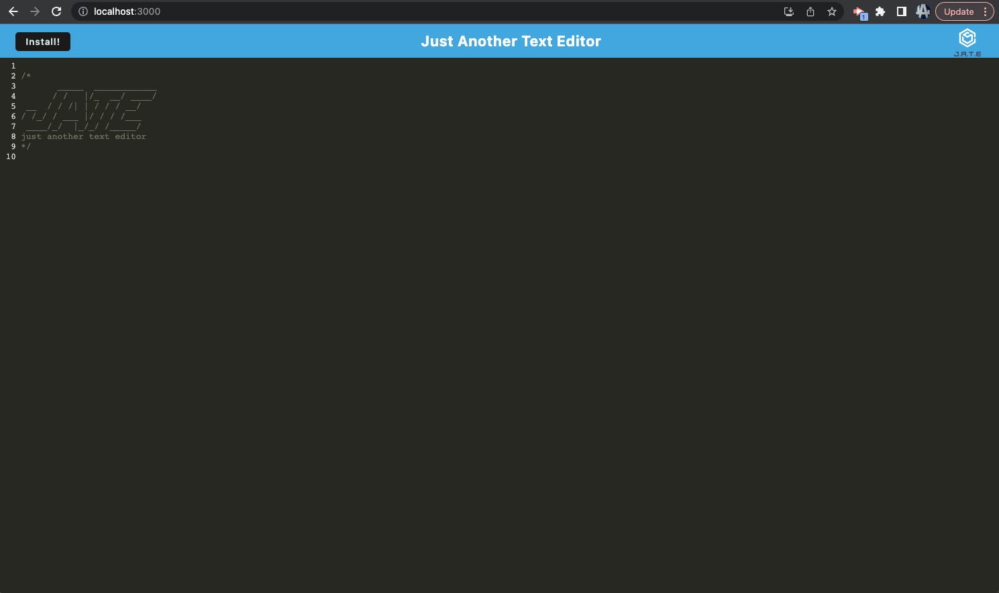
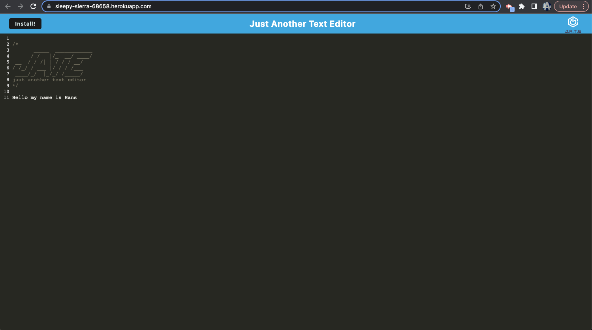

# Text-Editor

## Description

This web application provides users with a reliable text editor for creating notes and code snippets. It features offline functionality thanks to integrated service worker and Cache API's, ensuring that the application remains usable even without an active internet connection. Additionally, this app allows users to access previously visited pages even while offline, making it a convenient tool for productivity on the go.

### Live Application
My application is deployed on Heroku. To access it, click [here](https://sleepy-sierra-68658.herokuapp.com/).

## Application

## Installation

To install Just Another Text Editor, follow these steps:

1. Clone the repository to your local machine.
2. Open a terminal window and navigate to the root directory of the project.
3. Run the command npm install to install the required dependencies.
4. Run the command npm run start to start the application.
5. Open a web browser and navigate to http://localhost:3000 to use the text editor.

## Technologies Used
- Node.js
- Express.js
- Webpack
- IndexedDB
- Service Worker
- Cache API
- Workbox
- Heroku

